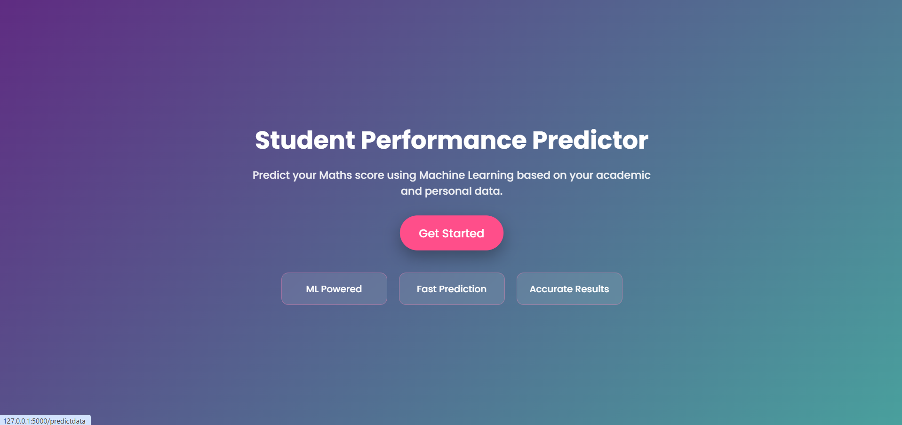
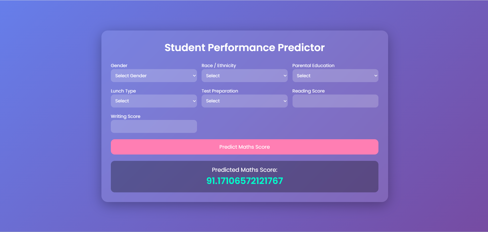

#  Student Exam Performance Predictor

A Machine Learning web application that predicts a student’s **Maths score** based on demographic and academic inputs such as gender, parental education, reading score, and writing score.

Built using **Flask + Scikit-learn**, this project demonstrates an end-to-end ML pipeline with a modern, user-friendly UI.

---

##  Features

-  Predicts Maths score using trained ML model  
-  End-to-end ML pipeline (data → preprocessing → prediction)  
-  Modern responsive UI (Glassmorphism design)  
-  Real-time prediction via Flask backend  
-  Clean and structured codebase  

---

## 📸 Screenshots

| Landing Page | Prediction Result |
|------------|------------------|
|  |  |

---

##  Tech Stack

**Frontend**
- HTML5  
- CSS3  

**Backend**
- Python  
- Flask  

**Machine Learning**
- Scikit-learn  
- Pandas  
- NumPy  

---

##  Project Structure
├── src/ │   ├── pipeline/ │   │   └── predict_pipeline.py │ ├── templates/ │   ├── index.html │   └── home.html │ ├── screenshots/ │   ├── home.png │   └── result.png │ ├── app.py ├── requirements.txt └── README.md

---

## Installation & Setup

### 1. Clone the repository
git clone https://github.com/Srushti-J/Student-Exam-Performance-Predictor.git⁠  
cd student-performance-predictor
### 2. Create virtual environment
python -m venv venv
Activate environment:

**Windows**
venv\Scripts\activate
**Mac/Linux**
source venv/bin/activate
### 3. Install dependencies
pip install -r requirements.txt
### 4. Run the application
python app.py
### 5. Open in browser
http://127.0.0.1:5000/
---

##  How It Works

1. User enters input features in the UI  
2. Flask captures the data using `request.form`  
3. Custom pipeline preprocesses the data  
4. Trained ML model predicts Maths score  
5. Result is displayed instantly  

---

##  Input Features

- Gender  
- Race / Ethnicity  
- Parental Level of Education  
- Lunch Type  
- Test Preparation Course  
- Reading Score  
- Writing Score  

---

##  Future Enhancements

-  Add charts for visualization  
-  Improve model accuracy  
-  Deploy application  
-  Add authentication system  
- Show prediction confidence  

---

##  Contributing

Feel free to fork this repository and submit pull requests.

---

## License

This project is licensed under the MIT License.

---

## Author

Srushti Joshi
GitHub: https://github.com/Srushti-J  

---

##  Support

If you like this project, give it a ⭐ on GitHub!
